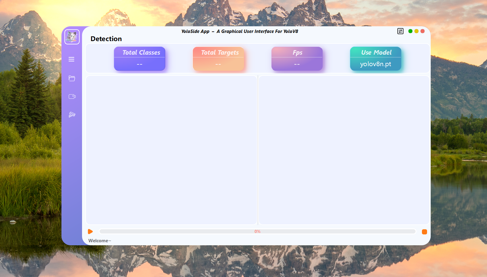

# LearnPySide6
---


最近想学习一下PySide6做一些算法相关的项目，找到了这三个项目： 
- [yolov8-pyside6](https://github.com/baslooo/yolov8-pyside6)
- [YOLOv8-PySide6](https://github.com/Jai-wei/YOLOv8-PySide6-GUI)
- [PyQt5-YOLOv5](https://github.com/Javacr/PyQt5-YOLOv5)

学习一下。

## How to Run

```bash
conda create -n learn_pyside6 python=3.10.11
conda activate learn_pyside6

pip install -r requirements.txt

python main.py
```

## About Packaging

```bash
pyside6-deploy main.py
```

## 注意事项
- 必须安装相应版本的库，否则会出现以下错误：`not enough values to unpack (expected 5, got 4)`；
- `ultralytics`遵循`GPL-3.0`，如果需要商业使用，需要获取其许可；
- 如果您期望使用自己的模型，您需要首先使用`ultralytics`训练**yolo**模型，然后将训练好的`.pt`文件放入`models`文件夹中；
- 软件中仍然存在一些bug，我会继续优化并在时间允许的情况下添加一些更有趣的功能；
- 结果会将被保存在`./run`路径中；
- UI设计文件是`home.ui`，如果您修改它，您需要使用`pyside6-uic home.ui > ui/home.py`命令重新生成`.py`文件；
- IMG资源文件是`resources.qrc`，如果您修改默认图标，您需要使用`pyside6-rcc resouces.qrc > ui/resources_rc.py`命令重新生成`.py`文件；

## 待办事项
- [ ] 输入源支持摄像头和RTSP（如果您需要这个功能紧急，您可以根据`main.py`中的`chosen_cam`、`chose_rtsp`、`load_rtsp`函数进行修改）
- [ ] 显示目标数量变化的图表
- [ ] 目标追踪
- [ ] 实例分割
- [ ] 监控系统硬件使用情况

## 参考文献
- [ultralytics](https://github.com/ultralytics/ultralytics)


